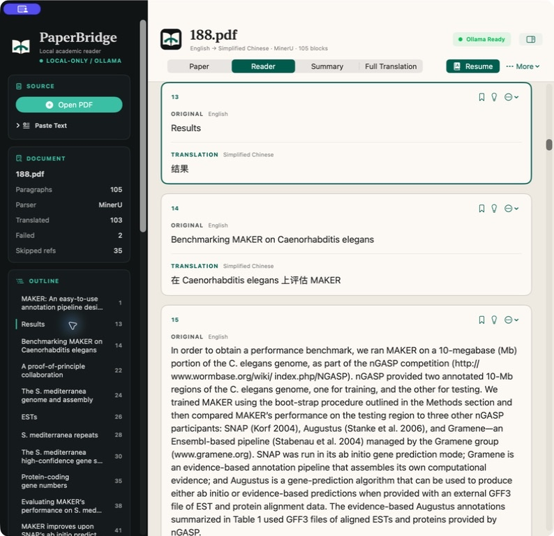
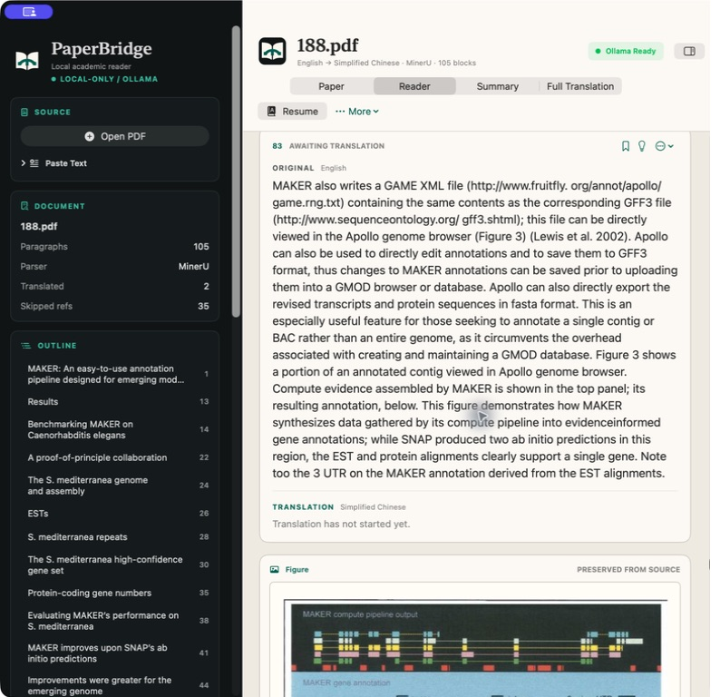
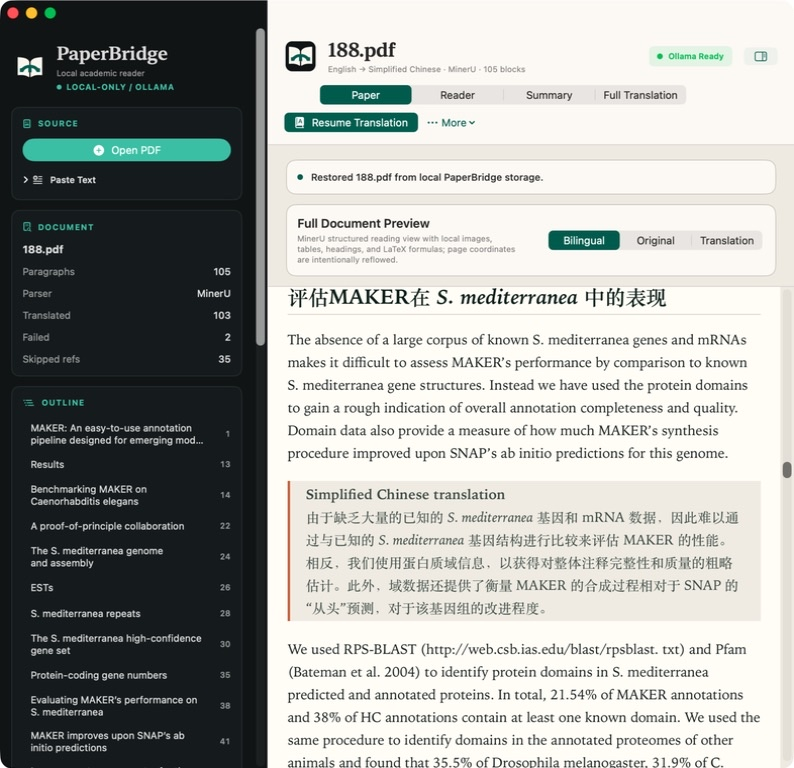
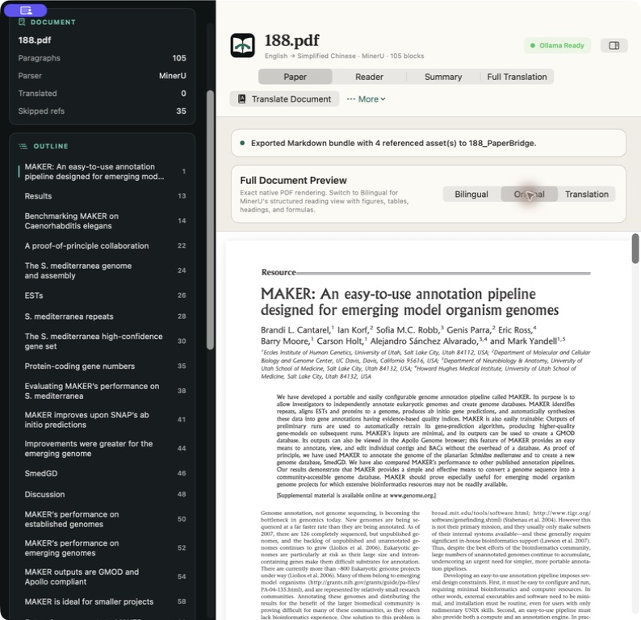
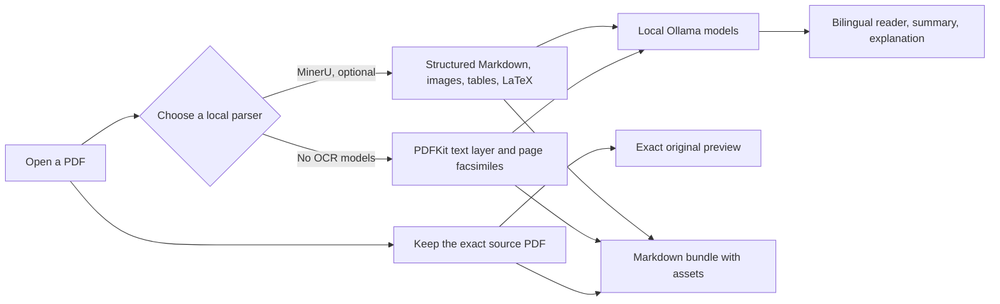

<p align="center">
  
</p>

<h1 align="center">PaperBridge</h1>

<p align="center">
  <strong>A local-first academic paper reader for macOS.</strong><br>
  Preserve the original PDF, read a structured paper, and translate or analyze it with local Ollama models.
</p>

<p align="center">
  <code>Native macOS</code> &nbsp; <code>SwiftUI</code> &nbsp; <code>Local-only</code> &nbsp; <code>PDFKit</code> &nbsp; <code>MinerU optional</code> &nbsp; <code>Ollama</code>
</p>

`PaperBridge` is a native macOS desktop app built with SwiftUI and Xcode. It always preserves the source PDF with a built-in, model-free PDFKit facsimile, and can optionally use MinerU to create semantic Markdown and LaTeX. Analysis prompts are sent only to your local Ollama server.
The bilingual reader remains available in aligned source/target order:

- original paragraph
- translated paragraph

It can also:

- generate a whole-paper summary in the source and target languages
- translate or explain an exact text selection without leaving the reader
- highlight selected text, attach notes, and bookmark paragraphs
- explain a full selected paragraph in simpler language
- optionally create a second, connected full-paper translation for smoother context
- preview either the exact original PDF or MinerU Markdown with headings, tables, figures, and LaTeX formulas
- create a structure-preserving full translation without changing formulas or image paths
- export original, translated, bilingual, and analysis Markdown with referenced assets
- accept pasted text directly when you do not want to load a PDF
- restore the most recent paper, translations, reading position, bookmarks, and annotations

## App Preview

### Bilingual paragraph reader

<p align="center">
  
</p>

<p align="center"><sub>An actual local Ollama translation in the paragraph reader. Each block keeps the source and translation together and supports selection tools, notes, bookmarks, explanation, and retry.</sub></p>

### Figures stay in the MinerU reading order

<p align="center">
  
</p>

<p align="center"><sub>Figures, tables, standalone formulas, code, and supported document elements are not sent for translation. They appear once, at their original MinerU position between the surrounding bilingual paragraph cards.</sub></p>

### Structured bilingual reading and exact-source verification

<table>
  <tr>
    <td width="50%"></td>
    <td width="50%"></td>
  </tr>
  <tr>
    <td><strong>Structured bilingual view</strong><br>MinerU reconstructs the reading order while local Ollama translations appear directly beside their source paragraphs, with figures, tables, and LaTeX retained in place.</td>
    <td><strong>Exact original view</strong><br>PDFKit renders the byte-for-byte source PDF so page layout, figures, fonts, and formulas can always be checked.</td>
  </tr>
</table>

The screenshots above are from the running app. MinerU produces a semantic reading view rather than a pixel-identical copy; the `Original` view remains the visual source of truth.

## How It Works



PDF parsing, translation, summary, explanation, preview generation, and caching happen on the Mac. PaperBridge does not require a cloud API.

## Features

- Native macOS app, not a browser app
- Clean three-pane workspace with document outline, reader, and research inspector
- MinerU-first parsing with a built-in, no-OCR `PDFKit` facsimile fallback
- Exact native PDF preview plus high-resolution page images for portable Markdown export
- Offline WebKit + bundled MathJax preview for formulas, images, and tables
- Local Ollama inference with `URLSession`
- In-app local AI setup for Ollama, TranslateGemma 4B, and optional MinerU
- Selectable translation direction
- PDF upload and pasted-text input
- Automatic detection of installed Ollama models
- Dedicated model settings for translation, summary, paragraph explanation, and quick lookup
- Progress bar during translation
- Paragraph-by-paragraph processing with failure isolation
- MinerU reading-order reconstruction for multi-column and complex academic layouts
- MinerU figures, tables, standalone formulas, and code interleaved with the corresponding Reader paragraphs
- One structure-preserving translation document shared by Translation preview, Full Translation, and Markdown export
- PDFKit selectable-text extraction with cross-page word and sentence repair
- Filtering of repeated headers, footers, and runs of extracted chart labels
- Automatic skipping of detected reference sections, including papers with methods after references
- Search plus bilingual, original-only, and translation-only reading modes
- Section outline navigation and paragraph bookmarks
- Selected-text translation, explanation, three-color highlights, and notes across Paper, Reader, Summary, and Full Translation
- Automatic local workspace recovery between launches
- Native menu commands and keyboard shortcuts
- Manual paragraph edit, split, merge, reflow, undo, and failed-translation retry controls
- Structure-preserving full-paper translation view
- Markdown bundle export with referenced assets; generated full translations receive their own Markdown file, and PDFKit bundles include the original PDF and facsimile pages

## Requirements

- macOS 14 or later
- Full Xcode from the Mac App Store only when building PaperBridge from source
- Internet access during the initial local tool and model downloads
- MinerU recommends at least 16 GB RAM; the built-in PDFKit mode does not have this requirement

Python, MinerU, Ollama, and an Ollama model do not need to be installed before PaperBridge starts. Open `PaperBridge > Settings > Local AI Setup` to install them from the app. The default `translategemma:4b` model is about 3.3 GB; MinerU plus its parsing models requires several additional gigabytes.

MinerU and its OCR/layout models are not required. If MinerU is unavailable, the default setting automatically uses PDFKit facsimile mode. Choose `PDFKit facsimile (no OCR)` to avoid external parsing models entirely, or `MinerU only` if you prefer a hard failure instead of fallback.

## PDF Preservation Modes

| Mode | Extra parser/model | What is preserved | What can be translated |
| --- | --- | --- | --- |
| MinerU | Optional local MinerU installation | Byte-for-byte original PDF plus structured Markdown, headings, reading order, images, tables, and reconstructed LaTeX | Parsed semantic text while formulas and assets remain protected |
| PDFKit facsimile | None; built into macOS | Byte-for-byte original PDF, native PDF view, and high-resolution page images with formulas, figures, and layout unchanged | Only text already embedded as a selectable PDF text layer |
| Image-only scan in PDFKit mode | None | Exact visual pages and export bundle | Nothing reliably; translation, summary, and explanation stay disabled until OCR supplies text |

Markdown is a semantic, reflowable format, so MinerU does not reproduce PDF coordinates, columns, pagination, fonts, or every OCR glyph exactly. PaperBridge therefore keeps the byte-for-byte source PDF beside MinerU's Markdown. Use `Original` for the exact native PDF and `Bilingual` for the structured reading view. The translated text remains a separate layer; it is not placed back over the original page coordinates.

PDFKit facsimile deliberately does not guess formulas or rebuild document structure. This is why it can preserve the visual source exactly without an OCR model.

## Project Structure

- `PaperBridge.xcodeproj`: Xcode project
- `PaperBridge/`: SwiftUI app source
- `PaperBridge/Services/LocalToolInstaller.swift`: verified user-level Ollama and MinerU setup
- `build_app.sh`: one-command terminal build script
- `test_text_processing.sh`: paragraph-processing regression tests
- `Tests/`: command-line regression test source
- `docs/images/`: README screenshots captured from the running app
- `README.md`: setup and usage guide
- `requirements.txt`: MinerU Python dependency used by the native app as a local command-line parser

## Quick Start

### 1. Create a normal project folder on your Mac

To avoid macOS permission problems, do not build this app inside `Documents` or `Downloads`.
Use a normal folder such as `~/Projects` instead:

```bash
mkdir -p ~/Projects
cd ~/Projects
```

### 2. Clone the repository

```bash
git clone https://github.com/haoyunLi/PaperBridge.git
cd PaperBridge
```

### 3. Complete Xcode first-launch setup once

Run these once on a new Mac:

```bash
sudo xcode-select -s /Applications/Xcode.app/Contents/Developer
sudo xcodebuild -license accept
sudo xcodebuild -runFirstLaunch
```

`build_app.sh` should work on another person's Mac without editing it, as long as:

- full Xcode is installed
- Xcode has finished first-launch setup
- `xcode-select` points to the Xcode developer directory

If their Xcode app is in the normal location, they usually do not need to change anything.
If they installed or renamed Xcode in a different location, they only need to point `xcode-select` at that Xcode once, for example:

```bash
sudo xcode-select -s "/Applications/Xcode-beta.app/Contents/Developer"
```

### 4. Build the macOS app from Terminal

From the project root:

```bash
./build_app.sh
```

The script builds relative to the repository folder, so users do not need to edit personal paths inside the script.

If the build succeeds, the generated app will be here:

```text
build/Build/Products/Release/PaperBridge.app
```

Open it with:

```bash
open "build/Build/Products/Release/PaperBridge.app"
```

### 5. Complete local AI setup inside PaperBridge

Open `PaperBridge > Settings > Local AI Setup`, then use the three setup cards:

1. Click `Install Ollama`, or `Start Ollama` when it is already installed.
2. Click `Download 4B Model` to pull `translategemma:4b` through Ollama's local API and select it for translation, summary, explanation, and quick lookup.
3. Optionally click `Install MinerU` for semantic Markdown, formulas, tables, images, and reading-order reconstruction.

The setup page shows download progress and supports cancellation. Ollama is downloaded from `ollama.com`, checked with macOS code-signing and Gatekeeper, and installed in `~/Applications` without an administrator password. The MinerU installer downloads a checksum-verified official `uv` binary, creates `~/.paperbridge-mineru`, installs `mineru[all]`, and preloads the Mac-compatible pipeline models. A failed update keeps the previous working MinerU environment.

MinerU is optional. Skip step 3 to use the built-in PDFKit facsimile without Python, OCR models, or parser downloads.

### Manual setup alternative

If an organization blocks in-app downloads, install the same components in Terminal:

```bash
open "https://ollama.com/download/mac"
open -a Ollama
ollama pull translategemma:4b
```

Install `Ollama.dmg` after the download page opens, then launch Ollama before running the pull command.

Optional MinerU:

```bash
python3 -m venv ~/.paperbridge-mineru
source ~/.paperbridge-mineru/bin/activate
python -m pip install --upgrade pip uv
uv pip install -r requirements.txt
mineru-models-download --source auto --model_type pipeline
deactivate
```

PaperBridge also auto-detects MinerU in `~/.local/bin`, `/opt/homebrew/bin`, `/usr/local/bin`, and Python user-bin folders. A custom executable can still be selected under `Settings > Document Parsing`.

## Terminal Build Flow

For users who want the exact terminal-only workflow:

```bash
mkdir -p ~/Projects
cd ~/Projects

git clone https://github.com/haoyunLi/PaperBridge.git
cd PaperBridge

sudo xcode-select -s /Applications/Xcode.app/Contents/Developer
sudo xcodebuild -license accept
sudo xcodebuild -runFirstLaunch

ollama pull translategemma:4b
ollama serve

./build_app.sh
open "build/Build/Products/Release/PaperBridge.app"
```

This manual flow builds and runs PaperBridge without MinerU or any OCR model. The in-app setup page is the recommended path for normal users.

## How the App Uses Models

When the app starts, it queries your local Ollama installation and automatically lists the models you already pulled.

Inside the app, you can choose:

- source language
- target language
- translation model
- summary model
- explanation model
- quick lookup model for selected-text translation and explanation

The app is not fixed to one language pair. English to Simplified Chinese is only the default.

The current UI includes common language options such as:

- English
- Simplified Chinese
- Traditional Chinese
- Japanese
- Korean
- French
- German
- Spanish
- Italian
- Portuguese
- Russian

The app does not require one fixed model family. It will show whatever Ollama reports locally.

## Recommended Model Choices

The exact best choice depends on your Mac's memory and speed.

### Translation

The default is the 3.3 GB `translategemma:4b`, which is the practical choice for most Macs:

```bash
ollama pull translategemma:4b
```

Use the larger 12B model when the Mac has enough memory and translation quality matters more than speed:

```bash
ollama pull translategemma:12b
```

### Summary and Explanation

You can use the installed `translategemma:4b` for every task, or choose a general-purpose local model for richer summary and explanation.

Examples from Ollama's Gemma 4 library:

```bash
ollama pull gemma4:e2b
ollama pull gemma4:e4b
ollama pull gemma4:26b
ollama pull gemma4:31b
```

Suggested rough guidance:

- smaller Macs: `gemma4:e2b` or `gemma4:e4b`
- stronger Macs: `translategemma:12b` or `gemma4:26b`
- high-memory Macs: `gemma4:31b`

You can mix them, for example:

- translation: `translategemma:4b`
- summary: `gemma4:e4b`
- explanation: `gemma4:e4b`

or:

- translation: `translategemma:4b`
- summary: `gemma4:e2b`
- explanation: `gemma4:e2b`

## Example Ollama Setup

### Balanced setup

```bash
ollama pull translategemma:4b
ollama pull gemma4:e4b
```

Then choose:

- `TRANSLATION_MODEL`: `translategemma:4b`
- `SUMMARY_MODEL`: `gemma4:e4b`
- `EXPLAIN_MODEL`: `gemma4:e4b`
- `FROM`: `English`
- `TO`: `Simplified Chinese`

### Lighter setup

```bash
ollama pull translategemma:4b
ollama pull gemma4:e2b
```

Then choose:

- `TRANSLATION_MODEL`: `translategemma:4b`
- `SUMMARY_MODEL`: `gemma4:e2b`
- `EXPLAIN_MODEL`: `gemma4:e2b`
- choose the `FROM` and `TO` languages that match your paper

## How to Use the App

1. Launch `PaperBridge.app`.
2. On first use, open `PaperBridge > Settings > Local AI Setup` and complete the Ollama and 4B model cards. MinerU is optional.
3. Open a PDF, drag one into the window, or paste text into the sidebar. PDFKit facsimile needs no model; optional MinerU may take several minutes on its first document.
4. Choose the `FROM` and `TO` languages in the left sidebar.
5. Open `Parser, Models & Settings` to choose the PDF parser, four task models, and translation chunk limit.
6. Start in the `Paper` workspace. For any PDF, `Original` uses Apple's native PDF viewer with the unchanged source file. For MinerU papers, `Bilingual` renders the reflowed structured Markdown, formulas, figures, tables, and section hierarchy.
7. Open `Reader` for clean analysis blocks and the aligned bilingual reading workflow. Manual paragraph repair is available only for PDFKit or pasted-text documents because MinerU controls structured Markdown layout.
8. Click `Translate` for aligned block-by-block translation. Formula, image, URL, code, and HTML tokens are protected before requests are sent to Ollama.
9. Select text in `Paper`, `Reader`, either `Summary` panel, or `Full Translation` to open the Research Inspector. From there you can translate, explain, highlight, or attach a note to the exact selection.
10. Use the bookmark button on a paragraph to add it to the sidebar's bookmark list.
11. Open the `Summary` workspace for source- and target-language summaries.
12. Open `Full Translation` for an optional context-aware translation. MinerU retains non-language Markdown blocks in place; PDFKit keeps the visual original unchanged and adds translation as a separate text layer.
13. Choose `More > Export Markdown Bundle` and select a destination folder.

For MinerU papers, the export folder contains:

```text
paper_original.md
paper_translation_<language>.md
paper_bilingual_<source>_<target>.md
paper_analysis_notes.md
original.pdf
images and other locally referenced assets
```

For PDFKit facsimile papers, the export folder contains:

```text
paper_original.md
paper_translation_<language>.md
paper_bilingual_<source>_<target>.md
paper_analysis_notes.md
original.pdf
pages/page-0001.png, page-0002.png, ...
```

`original.pdf` is copied without modification in both MinerU and PDFKit exports. PDFKit page PNG files additionally make the visual paper portable in Markdown viewers that cannot embed a PDF directly.

## Keyboard Shortcuts

- `Command-O`: open a PDF
- `Command-Return`: translate or resume
- `Command-Shift-E`: export Markdown
- `Command-Shift-I`: show the Research Inspector
- `Command-Shift-T`: translate selected text
- `Command-Option-E`: explain selected text
- `Command-Shift-H`: highlight selected text in amber

## Local Recovery and Privacy

PaperBridge stores recovery data only on the current Mac:

```text
~/Library/Application Support/PaperBridge
```

This includes app settings, MinerU Markdown/assets, the most recent workspace, translated blocks, summaries, bookmarks, highlights, and notes. Use `Parser, Models & Settings > Local Data` to clear this recovery data.

## Behavior Notes

- MinerU and PDFKit process PDFs locally. Initial MinerU model installation/download is the only optional parser setup step that requires internet access.
- MinerU Markdown follows the paper's detected semantic structure and reading order, not its exact page geometry. The unchanged `original.pdf` remains the source of truth for visual comparison.
- PDFKit facsimile uses only Apple frameworks already included with macOS. It saves an unchanged original PDF plus page images, so equations and figures remain visually exact even when semantic extraction is imperfect.
- To prevent very long papers from consuming excessive disk space, portable PNG previews are capped at the first 120 pages. The unchanged `original.pdf` and native PDF viewer still contain every page.
- Without OCR, an image-only scanned PDF has no text to send to Ollama. PaperBridge still enables exact preview and Markdown bundle export, but disables translation, summary, and explanation.
- The app can also process pasted text locally without needing a PDF file.
- Ollama calls are restricted to `localhost`, `127.0.0.1`, or `::1` on your Mac.
- Building under `~/Projects` is recommended to avoid macOS protected-folder issues.
- The translation direction is configurable. English to Simplified Chinese is only the default, not the only option.
- Long paragraphs are chunked only for translation reliability.
- Translation chunks are split at sentence or clause boundaries whenever possible, then reassembled into one translated paragraph.
- PDF line-wrap fragments such as `mea- sure` and `out- perform` are repaired while established compounds such as `model-based` remain hyphenated.
- MinerU headings remain independent Markdown heading blocks and drive the document outline.
- If one paragraph translation fails, the rest continue.
- Failed paragraphs have an individual `Retry` button.
- Full-paper translation is optional and is not run automatically with the reader translation.
- If the app confidently detects a `References` or `Bibliography` section, it excludes those blocks from translation, summary, and explanation while retaining the original references in preview and exported Markdown.
- If MinerU fails and fallback is enabled, PaperBridge explains the reason and switches to the model-free PDFKit facsimile plus its selectable-text reconstruction pipeline.

## Paragraph Regression Tests

After changing text extraction or paragraph rules, run:

```bash
./test_text_processing.sh
```

The tests cover cross-page words, spaced PDF word fragments, incomplete phrases, citations, headings, equations, chart-label runs, references, MinerU Markdown segmentation, protected formula/image tokens, structure-preserving reconstruction, asset discovery, MinerU process execution, exact PDF facsimile archiving, page rendering, cache reuse, and failed-output recovery.

## Troubleshooting

### The build reports missing Xcode components or an unaccepted license

The script may print a note when Xcode's first-launch status cannot be checked. It will still try the real build. If that build fails with a setup or license error, run:

```bash
sudo xcode-select -s /Applications/Xcode.app/Contents/Developer
sudo xcodebuild -license accept
sudo xcodebuild -runFirstLaunch
```

### The app opens but no models appear

Open `Settings > Local AI Setup`. Start or install Ollama, then use `Download 4B Model`. The equivalent manual commands are:

```bash
ollama serve
```

Then pull at least one model:

```bash
ollama pull translategemma:4b
```

Then relaunch the app or click `Refresh Models`.

### PaperBridge says MinerU is unavailable

You can ignore this message if you do not want OCR/parser models. Open `Settings > Document Parsing`, choose `PDFKit facsimile (no OCR)`, and continue without installing Python dependencies.

Digital PDFs with selectable text support translation, summary, and explanation in this mode. Image-only scans support exact preview and export only.

If you do want MinerU, first use `Settings > Local AI Setup > Install MinerU`. To verify the managed environment manually:

```bash
~/.paperbridge-mineru/bin/mineru --version
```

If that works, open `PaperBridge > Settings > Document Parsing` and set:

```text
~/.paperbridge-mineru/bin/mineru
```

The GUI app does not inherit every shell-specific `PATH`, which is why PaperBridge supports both common-path discovery and an explicit executable path.

### MinerU parsing is slow or uses too much memory

Open `Settings > Document Parsing` and choose `Pipeline / Mac compatible (recommended)`, or choose `PDFKit facsimile (no OCR)`. The first MinerU run is normally the slowest because models may still be downloading or warming up.

### Translation is too slow

Try a smaller local model, such as:

- `translategemma:4b`
- `gemma4:e2b`
- `gemma4:e4b`

### The app builds but does not launch from Finder

Try launching it from Terminal:

```bash
open "build/Build/Products/Release/PaperBridge.app"
```

### Finder or the Dock still shows an old or generic icon

Quit any older copy of PaperBridge, rebuild with `./build_app.sh`, and open the app from `build/Build/Products/Release`. The build script registers that exact app path with LaunchServices, and PaperBridge also refreshes its running icon from the bundled `AppIcon.icns`.

If the Dock still keeps an older cached image, restart only the Dock once:

```bash
killall Dock
```

Then reopen:

```bash
open "build/Build/Products/Release/PaperBridge.app"
```

## Sources

- MinerU repository: [https://github.com/opendatalab/MinerU](https://github.com/opendatalab/MinerU)
- MinerU official quick start: [https://opendatalab.github.io/MinerU/quick_start/](https://opendatalab.github.io/MinerU/quick_start/)
- MinerU model download/source guide: [https://opendatalab.github.io/MinerU/usage/model_source/](https://opendatalab.github.io/MinerU/usage/model_source/)
- MinerU CLI documentation: [https://opendatalab.github.io/MinerU/usage/cli_tools/](https://opendatalab.github.io/MinerU/usage/cli_tools/)
- MinerU output formats: [https://opendatalab.github.io/MinerU/reference/output_files/](https://opendatalab.github.io/MinerU/reference/output_files/)
- uv official installation and release artifacts: [https://docs.astral.sh/uv/getting-started/installation/](https://docs.astral.sh/uv/getting-started/installation/)
- Apple PDFKit `PDFPage` documentation: [https://developer.apple.com/documentation/PDFKit/PDFPage](https://developer.apple.com/documentation/PDFKit/PDFPage)
- Apple PDFKit `PDFSelection` documentation: [https://developer.apple.com/documentation/pdfkit/pdfselection](https://developer.apple.com/documentation/pdfkit/pdfselection)
- Ollama TranslateGemma library: [https://ollama.com/library/translategemma](https://ollama.com/library/translategemma)
- Ollama Gemma 4 library: [https://ollama.com/library/gemma4](https://ollama.com/library/gemma4)
- Ollama download page: [https://ollama.com/download/mac](https://ollama.com/download/mac)
