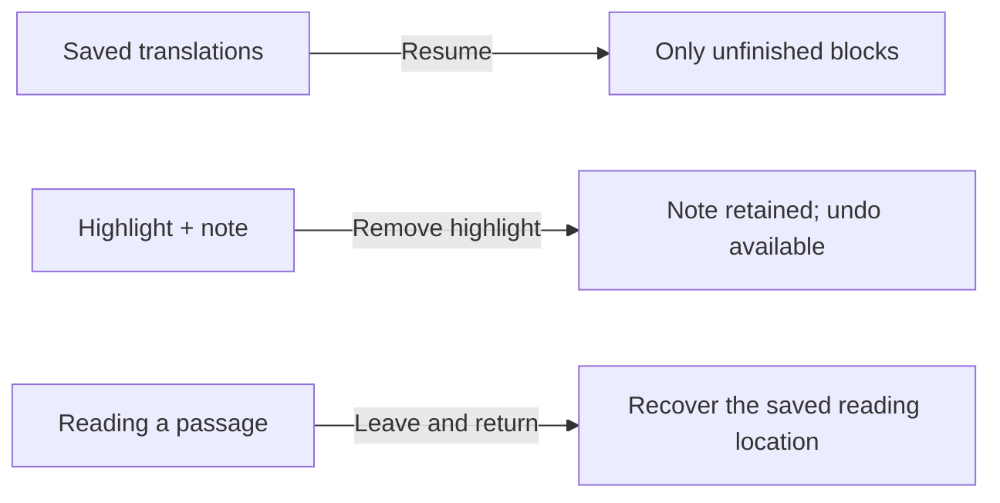
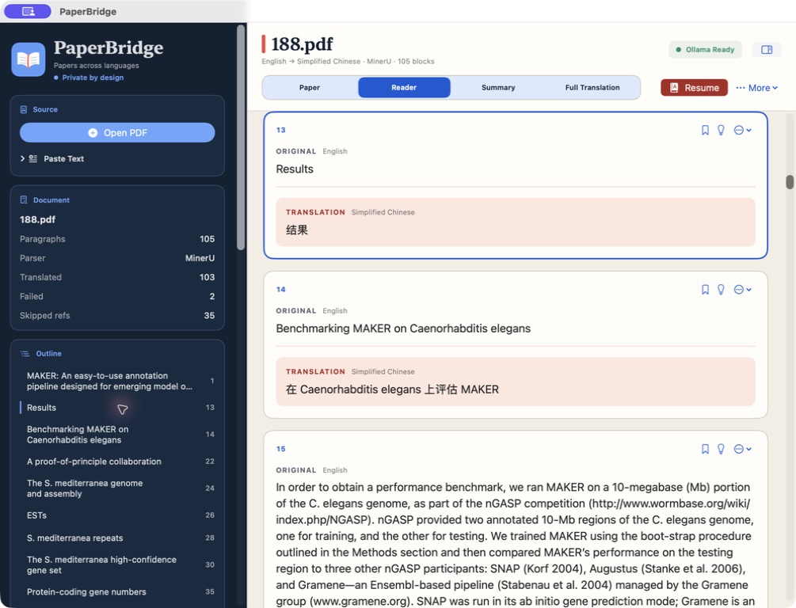
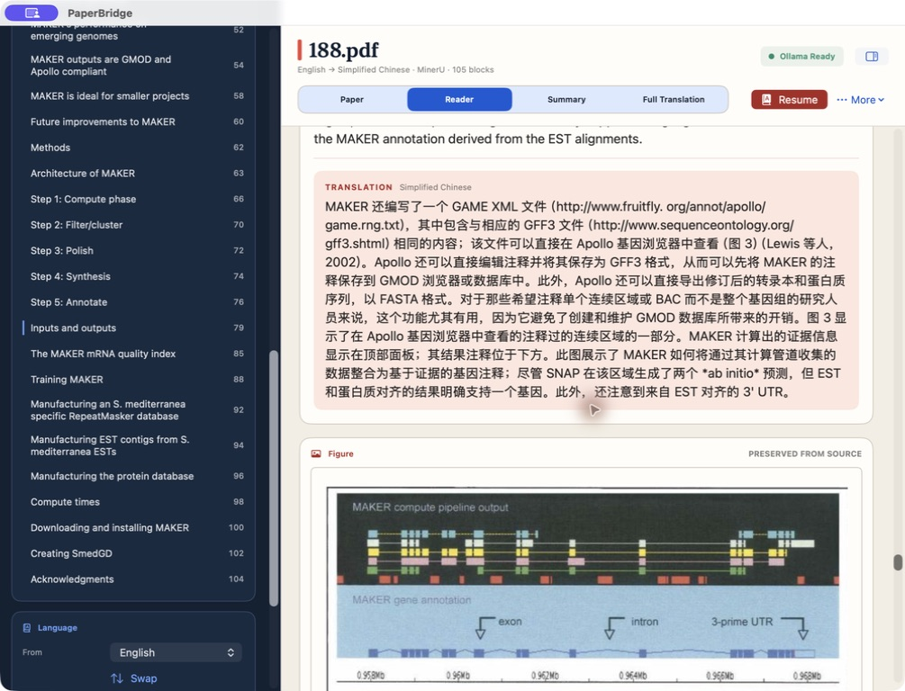
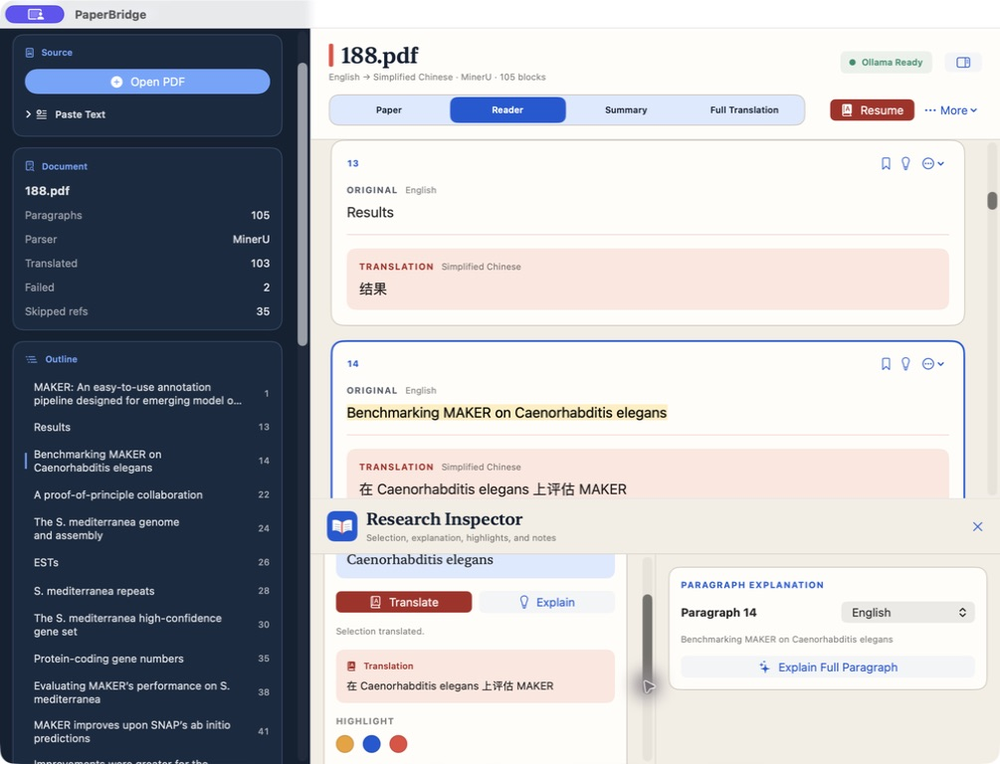
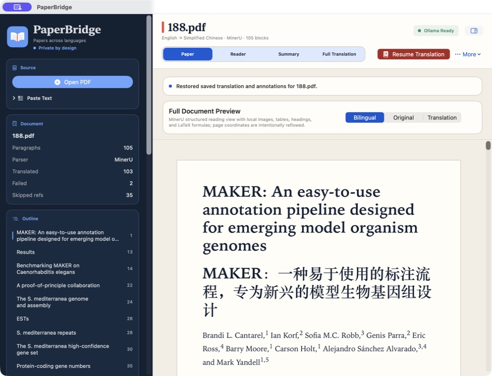
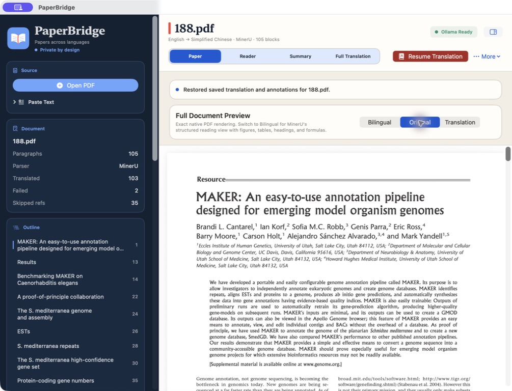
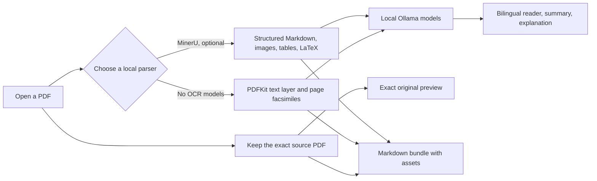

<p align="center">
  
</p>

<h1 align="center">PaperBridge</h1>

<p align="center">
  <strong>A local-first academic paper reader for macOS, with a Windows development preview.</strong><br>
  Preserve the original PDF, read a structured paper, and translate or analyze it with local Ollama models.
</p>

<p align="center">
  <a href="https://paperbridges.net"><strong>Official Website</strong></a>
  &nbsp;·&nbsp;
  <a href="https://github.com/haoyunLi/PaperBridge/releases/latest/download/PaperBridge.dmg"><strong>Download for macOS</strong></a>
  &nbsp;·&nbsp;
  <a href="windows/README.md"><strong>Windows development preview</strong></a>
  &nbsp;·&nbsp;
  <a href="#build-from-source"><strong>Build from Source</strong></a>
</p>

<p align="center">
  <code>Native macOS</code> &nbsp; <code>SwiftUI</code> &nbsp; <code>Local-only</code> &nbsp; <code>PDFKit</code> &nbsp; <code>MinerU recommended</code> &nbsp; <code>Ollama</code>
</p>

`PaperBridge` is a native macOS desktop app built with SwiftUI and Xcode. It always preserves the source PDF with a built-in, model-free PDFKit facsimile, and can optionally use MinerU to create semantic Markdown and LaTeX. Analysis prompts are sent only to your local Ollama server.
The bilingual reader remains available in aligned source/target order:

- original paragraph
- translated paragraph

It can also:

- generate a whole-paper summary in the source and target languages
- translate or explain an exact text selection without leaving the reader
- highlight selected text, attach notes, and bookmark paragraphs
- explain a full selected paragraph in simpler language
- optionally create a second, connected full-paper translation for smoother context
- preview either the exact original PDF or MinerU Markdown with headings, tables, figures, and LaTeX formulas
- create a structure-preserving full translation without changing formulas or image paths
- export original, translated, bilingual, and analysis Markdown with referenced assets
- accept pasted text directly when you do not want to load a PDF
- restore the most recent paper, translations, reading position, bookmarks, and annotations

The same repository contains the active [Windows development preview](windows/README.md), including six-section Settings, local Ollama/MinerU setup with AMD/NVIDIA-aware detection, MinerU Auto-Detect, restart-persistent update prompts, NSIS/portable packaging, and the 1.9.1 note reliability path: 350 ms autosave, edit-end/quit flush, session undo, fixed save status and retry. Its macOS 1.9 baseline and the remaining 1.9.1 gaps are tracked separately in the [feature mapping](windows/FEATURE_MAPPING.md) and [1.9.1 incremental report](windows/MAC_1_9_1_GAPS.md).

## Reading Continuity in 1.9.1

PaperBridge 1.9.1 is a small reading-continuity update to 1.9. [Download the latest Mac app](https://github.com/haoyunLi/PaperBridge/releases/latest/download/PaperBridge.dmg), or choose **PaperBridge > Check for Updates** in the app.

- Notes save automatically after a short typing pause, and pending edits are saved when you change selection, close the inspector, switch papers, or quit normally. **Save Now** and session undo remain available. A force quit or power loss during the typing delay can still lose the last keystrokes.
- **Back / Forward** in the reading header (or `Command-[` / `Command-]`) returns to previous section, source, and annotation jump locations. History is session-only, holds up to 50 locations, and resets when switching papers or repairing paragraph structure. Reader restoration is block-level; PDF restoration remains page-level.
- Standalone headings use compact bilingual rows, without duplicate title cards. Headings that share a paragraph with body text remain intact.
- Task progress and local-save status stay above the scrolling document. Save failures keep the in-memory note and offer **Retry Save**; keep the app open or export until saving succeeds.

Try the matching [interactive website examples](https://paperbridges.net/#reading-update). This update does not add library backup/import, per-paper deletion, or background multi-paper tasks. See [release notes](docs/release-1.9.1.md) and [verification notes](docs/reliability-update.md#reading-continuity-in-191).

## Reading Reliability in 1.9

**New in PaperBridge 1.9.** This release focuses on staying with the paper rather than redoing work. [Try the interactive website examples](https://paperbridges.net/#reading-update) or read the [implementation and verification notes](docs/reliability-update.md).

| When reading gets interrupted | What changes in 1.9 |
| --- | --- |
| You do not know where to start | Overview shows exact passages from detected question, method, evidence, discussion, and conclusion sections. Click through to the source; no model is used. |
| You have not installed any models | Try a fictional practice paper from the welcome screen. Reading, highlights, and notes work without AI; missing AI dependencies lead to setup instead of an unexplained failure. |
| A translation stops partway through | Resume saved pending/failed blocks without retranslating successful ones. Cancelled requests cannot overwrite a replacement task. |
| You remove a highlight | The attached note stays. Highlight/note changes can be undone within the current document session. |
| You switch views or reopen the paper | Recover the saved Reader block, original PDF page, or Markdown viewport. Annotation links validate their saved location. |
| The window gets crowded | Hide the document sidebar, keep search above the Reader, and use a bottom inspector in narrower windows. Bookmarks show text previews. |
| Setup or saving needs attention | Downloads can continue in the background, and local save errors are shown instead of silently ignored. |
| A paragraph ends with a broken word | Overview flags possible extraction issues and links to the affected Reader block. Check the original before using edit/split/merge; no speculative auto-correction. |
| You only need the methods or conclusion | More > Translation Range offers Abstract & Conclusion, the current section, any detected section, or all unfinished blocks. The current section can move ahead in an active paragraph queue. |
| You are reading several papers | Paper Library searches local titles/tags and restores each paper's translations, notes, bookmarks, task settings, and reading position. |
| A term keeps returning | Use compact selected-text help, then save an approved translation in Saved Terminology. Matching language-direction terms guide future requests without rewriting existing translations. |
| An AI summary sounds too certain | Check the Sources lists exact-match source quotations for numbered claims. Invalid references remain unlinked; quotation matching is not verification of the model's reasoning. |
| The page is tiring to read | Reading Appearance adjusts text size, line spacing, and width. Focus Reading hides both side panels and restores their previous state when you exit. |


```mermaid
flowchart LR
    A["Saved translations"] -->|"Resume"| B["Only unfinished blocks"]
    C["Highlight + note"] -->|"Remove highlight"| D["Note retained; undo available"]
    E["Reading a passage"] -->|"Leave and return"| F["Recover the saved reading location"]
```

These improvements do not mean that every PDF now splits perfectly. The reading map quotes existing text; it does not generate scientific answers or invent missing sections. New AI summaries separately provide source quotations where they can be validated, but do not certify scientific claims. Website examples use illustrative data, not live model output. Download links serve the latest signed release; existing users can choose PaperBridge > Check for Updates.

### Reading efficiency: step by step

1. **Review extraction:** open Overview's extraction check. Select Review, then compare Original. Unstructured text can be edited, split, merged, or reflowed using Reader's existing paragraph actions. MinerU controls structured blocks; correct an exported Markdown copy instead of breaking image/formula associations. Warnings are heuristics, not proof of an error, and no text is automatically rewritten.
2. **Choose the translation range:** open More > Translation Range. Abstract & Conclusion translates just those detected sections; use Resume All Untranslated Blocks later. During paragraph translation, scroll to a section and choose Prioritize Current Section in Queue. The in-flight paragraph finishes first, completed output is retained, and only queued blocks are reordered. Full Translation remains a separate document-wide task.
3. **Reopen a paper:** choose Paper Library from the sidebar, More, or the Paper menu (`Shift-Command-L`). Search by title/tag and edit library labels with the pencil. Each saved paper restores its task settings, translations, notes, bookmarks, and position. Global reading appearance stays unchanged. The last readable save is retained locally for corruption recovery, but it is not an independent backup or synchronization; do not delete associated resource folders.
4. **Keep useful terminology:** select a short phrase. The compact help panel does not resize the reader; Notes & More opens the full inspector. Choose Save Term and review the translation. More > Saved Terminology lists/removes saved terms. Up to 500 entries are allowed (160 source / 300 target characters each). Up to 24 matching terms guide a request; models can still ignore or misuse them. Existing completed translations are never silently replaced.
5. **Verify a summary:** generate a new summary in Overview and expand Check the Sources. Both language summaries use the same numbered claims. Read Original Paragraph opens an exact-match quotation's paragraph. Invalid IDs, fabricated quotes, or unstructured model output receive no validated links. Old summaries remain readable; generating again upgrades them to the new format. Source excerpts also accompany the analysis Markdown export.
6. **Set reading comfort:** use the text-size button in the header for size, spacing, and width. Use Focus Reading (`Control-Command-F`) to hide side panels temporarily. These preferences affect Reader and text previews, not original PDF geometry or exported Markdown. Every Paper / Reader / Overview / Full Translation segment has a full-area click target.

Paper Library and terminology are stored alongside the existing application-support workspace files. Older saves are discovered without deleting them. Paragraph edits keep the same library entry and preserve the original PDF resource location; earlier saved variants are not advertised as a cloud version history.

Reopening or dropping the same original PDF restores its saved revision, rather than overwriting repaired paragraphs. To try a different parser, choose **More > Re-extract PDF as New Copy...** and select the source PDF; your previous library copy remains unchanged. Splits/merges move bookmarks and resolvable annotations with their source text. Notes whose text changed or became ambiguous remain in the inspector as **Source changed · note preserved**, without a misleading highlight. Undo restores old anchors and keeps notes added since the edit.

Each changed local JSON save retains one readable `.backup` beside it and automatically falls back to that copy if the primary file is unreadable. This protects against a damaged save, not disk loss, deleted assets, or every older version. Export Markdown bundles and use your own backup for important papers.

## Your First Paper

### Install the ready-made Mac app

1. [Download PaperBridge.dmg](https://github.com/haoyunLi/PaperBridge/releases/latest/download/PaperBridge.dmg), open it, and drag PaperBridge into Applications.
2. Launch PaperBridge from Applications. **You do not need Xcode, Homebrew, or a PaperBridge account.** macOS 14 or later is required. A separate [Windows development preview](windows/README.md) is available from source.
3. Choose your route below. The setup guide can be reopened from `PaperBridge > PaperBridge Getting Started` or `Settings > Local AI`.

| What you want to do | What to install |
| --- | --- |
| Read the original PDF, highlight selectable text, and take notes | PaperBridge alone. PDFKit is built in; an image-only scan requires OCR for selectable text. |
| Translate paragraphs or a whole paper | Ollama plus a translation model. Setup offers TranslateGemma 4B, 12B, and 27B; choose a size appropriate for your Mac. |
| Improve reading order and preserve structured figures, tables, and formulas | MinerU is a separate recommended setup step. Without it, PDFKit retains exact pages but cannot reconstruct their semantic structure. |
| Explain a phrase or summarize the paper | An optional explanation/summary model in Ollama, such as one of the Gemma or Qwen choices in setup. Translation settings can also be needed for bilingual outputs. |

Initial downloads require internet, disk space, and time. Model size on disk does not guarantee that it will fit in runtime memory; MinerU recommends at least 16 GB RAM. The smaller translation model is a useful starting point when resources are limited.

### A short reading workflow

1. Open a PDF or paste a passage. `Try a Practice Paper` provides fictional tutorial text without a model download and without replacing an already open paper.
2. Inspect the original. PaperBridge opens text-bearing papers in **Overview**, where a source reading map links to detected sections. It falls back to an opening passage when headings are unclear. The optional AI summary is below it, clearly separated.
3. Read one passage and translate it when needed. Select an unfamiliar phrase to translate only that selection, or use an optional model to explain it. Check scientific claims against the source.
4. Highlight, add a note, or bookmark a useful paragraph. Search to find a term; `Control-Command-S` hides the document sidebar and `Command-1` opens Overview.
5. Use Full Translation for continuous reading. Export Markdown **with its assets** and keep those files together. Local workspace recovery is not a backup; export important work.

Figures are not repainted or translated internally. Captions can be translated; formulas and supported resource blocks remain protected. MinerU Markdown preserves semantic reading order, not PDF page coordinates. Always use Original for a precise visual check.

[Explore the website feature guide](https://paperbridges.net/#capabilities) for task-by-task explanations and [choose a setup route](https://paperbridges.net/#getting-started). Website updates do not themselves publish app updates; use `Check for Updates` after a signed release becomes available.

## App Preview

### Bilingual paragraph reader

<p align="center">
  
</p>

<p align="center"><sub>An actual local Ollama translation in the redesigned reader. Cobalt identifies navigation and source context; coral identifies completed translated content. Each block supports selection tools, notes, bookmarks, explanation, and retry.</sub></p>

### Figures stay in the MinerU reading order

<p align="center">
  
</p>

<p align="center"><sub>The surrounding caption is translated while the figure itself remains unchanged. Figures, tables, standalone formulas, code, and supported document elements appear once at their original MinerU position.</sub></p>

### Selection translation, explanation, highlights, and notes

<p align="center">
  
</p>

<p align="center"><sub>Select an exact phrase in Paper, Reader, Summary, or Full Translation. The responsive Research Inspector keeps quick translation, explanation, three-color highlights, notes, and full-paragraph explanation together.</sub></p>

### Structured bilingual reading and exact-source verification

<table>
  <tr>
    <td width="50%"></td>
    <td width="50%"></td>
  </tr>
  <tr>
    <td><strong>Structured bilingual view</strong><br>MinerU reconstructs the reading order while local Ollama translations appear directly beside their source paragraphs, with figures, tables, and LaTeX retained in place.</td>
    <td><strong>Exact original view</strong><br>PDFKit renders the byte-for-byte source PDF so page layout, figures, fonts, and formulas can always be checked.</td>
  </tr>
</table>

The screenshots above are from the running app. MinerU produces a semantic reading view rather than a pixel-identical copy; the `Original` view remains the visual source of truth.

## How It Works


```mermaid
flowchart LR
    A["Open a PDF"] --> B["Keep the exact source PDF"]
    A --> C{"Choose a local parser"}
    C -->|"MinerU, optional"| D["Structured Markdown, images, tables, LaTeX"]
    C -->|"No OCR models"| E["PDFKit text layer and page facsimiles"]
    D --> F["Local Ollama models"]
    E --> F
    F --> G["Bilingual reader, summary, explanation"]
    B --> H["Exact original preview"]
    D --> I["Markdown bundle with assets"]
    E --> I
    B --> I
```

PDF parsing, translation, summary, explanation, preview generation, and caching happen on the Mac. PaperBridge does not require a cloud API.

## Features

- Native macOS app, not a browser app
- Clean three-pane workspace with document outline, reader, and research inspector
- MinerU-first parsing with a built-in, no-OCR `PDFKit` facsimile fallback
- Exact native PDF preview plus high-resolution page images for portable Markdown export
- Offline WebKit + bundled MathJax preview for formulas, images, and tables
- Local Ollama inference with `URLSession`
- First-launch setup guide with separate pages for Ollama, TranslateGemma 4B/12B/27B, recommended MinerU, and optional explanation models
- In-app update checks and installation from signed, notarized GitHub Releases
- Selectable translation direction
- PDF upload and pasted-text input
- Automatic detection of installed Ollama models
- Dedicated model settings for translation, summary, paragraph explanation, and quick lookup
- Progress bar during translation
- Paragraph-by-paragraph processing with failure isolation
- MinerU reading-order reconstruction for multi-column and complex academic layouts
- MinerU figures, tables, standalone formulas, and code interleaved with the corresponding Reader paragraphs
- One structure-preserving translation document shared by Translation preview, Full Translation, and Markdown export
- PDFKit selectable-text extraction with cross-page word and sentence repair
- Filtering of repeated headers, footers, and runs of extracted chart labels
- Automatic skipping of detected reference sections, including papers with methods after references
- Search plus bilingual, original-only, and translation-only reading modes
- Section outline navigation and paragraph bookmarks
- Selected-text translation, explanation, three-color highlights, and notes across Paper, Reader, Summary, and Full Translation
- Automatic local workspace recovery between launches
- Native menu commands and keyboard shortcuts
- Manual paragraph edit, split, merge, reflow, undo, and failed-translation retry controls
- Structure-preserving full-paper translation view
- Markdown bundle export with referenced assets; generated full translations receive their own Markdown file, and PDFKit bundles include the original PDF and facsimile pages

## Requirements

- macOS 14 or later
- Full Xcode from the Mac App Store only when building PaperBridge from source
- Internet access during the initial local tool and model downloads
- MinerU recommends at least 16 GB RAM; the built-in PDFKit mode does not have this requirement

People who install the signed `PaperBridge.dmg` release do not need Xcode or
Homebrew. Sparkle is bundled inside the app and handles future updates. Xcode is
required only for contributors who build from source and maintainers who publish
signed releases.

Python, MinerU, Ollama, and an Ollama model do not need to be installed before PaperBridge starts. The first-launch guide installs or opens Ollama, recommends a TranslateGemma size for the Mac, then presents MinerU and explanation models on separate setup pages. It can be reopened from `PaperBridge > PaperBridge Getting Started` or `Settings > Local AI`.

PaperBridge remembers the completed setup-guide revision. When an update introduces an important new setup step, the revised guide opens once after updating; ordinary app updates do not repeatedly show it.

MinerU and its OCR/layout models are technically optional, but installing MinerU is strongly recommended for the best reading order, paragraph structure, figures, tables, formulas, and Markdown exports. If MinerU is unavailable, the default setting automatically uses PDFKit facsimile mode. Choose `PDFKit facsimile (no OCR)` to avoid external parsing models entirely, or `MinerU only` if you prefer a hard failure instead of fallback.

## PDF Preservation Modes

| Mode | Extra parser/model | What is preserved | What can be translated |
| --- | --- | --- | --- |
| MinerU | Optional local MinerU installation | Byte-for-byte original PDF plus structured Markdown, headings, reading order, images, tables, and reconstructed LaTeX | Parsed semantic text while formulas and assets remain protected |
| PDFKit facsimile | None; built into macOS | Byte-for-byte original PDF, native PDF view, and high-resolution page images with formulas, figures, and layout unchanged | Only text already embedded as a selectable PDF text layer |
| Image-only scan in PDFKit mode | None | Exact visual pages and export bundle | Nothing reliably; translation, summary, and explanation stay disabled until OCR supplies text |

Markdown is a semantic, reflowable format, so MinerU does not reproduce PDF coordinates, columns, pagination, fonts, or every OCR glyph exactly. PaperBridge therefore keeps the byte-for-byte source PDF beside MinerU's Markdown. Use `Original` for the exact native PDF and `Bilingual` for the structured reading view. The translated text remains a separate layer; it is not placed back over the original page coordinates.

PDFKit facsimile deliberately does not guess formulas or rebuild document structure. This is why it can preserve the visual source exactly without an OCR model.

## Project Structure

- `PaperBridge.xcodeproj`: Xcode project
- `PaperBridge/`: SwiftUI app source
- `PaperBridge/Services/LocalToolInstaller.swift`: verified user-level Ollama and MinerU setup
- `PaperBridge/Services/AppUpdateController.swift`: secure Sparkle update integration
- `build_app.sh`: one-command terminal build script
- `package_release.sh`: signed and notarized release-package builder for maintainers
- `publish_release.sh`: one-command GitHub Release publisher for maintainers
- `test_text_processing.sh`: paragraph-processing regression tests
- `test_reading_reliability.sh`: offline source-map, practice-paper, workspace, translation-resume, cancellation, and annotation tests
- `test_markdown_interaction.sh`: local WebKit selection, navigation, and reading-position tests
- `script/build_and_run.sh`: rebuild and open a development app, optionally with an isolated workspace
- `Tests/`: command-line regression test source
- `docs/images/`: README screenshots captured from the running app
- `README.md`: setup and usage guide
- `requirements.txt`: MinerU Python dependency used by the native app as a local command-line parser

## Quick Start

### 1. Create a normal project folder on your Mac

To avoid macOS permission problems, do not build this app inside `Documents` or `Downloads`.
Use a normal folder such as `~/Projects` instead:

```bash
mkdir -p ~/Projects
cd ~/Projects
```

### 2. Clone the repository

```bash
git clone https://github.com/haoyunLi/PaperBridge.git
cd PaperBridge
```

### 3. Complete Xcode first-launch setup once

Run these once on a new Mac:

```bash
sudo xcode-select -s /Applications/Xcode.app/Contents/Developer
sudo xcodebuild -license accept
sudo xcodebuild -runFirstLaunch
```

`build_app.sh` should work on another person's Mac without editing it, as long as:

- full Xcode is installed
- Xcode has finished first-launch setup
- `xcode-select` points to the Xcode developer directory

If their Xcode app is in the normal location, they usually do not need to change anything.
If they installed or renamed Xcode in a different location, they only need to point `xcode-select` at that Xcode once, for example:

```bash
sudo xcode-select -s "/Applications/Xcode-beta.app/Contents/Developer"
```

### 4. Build the macOS app from Terminal

From the project root:

```bash
./build_app.sh
```

The script builds relative to the repository folder, so users do not need to edit personal paths inside the script.

If the build succeeds, the generated app will be here:

```text
build/Build/Products/Release/PaperBridge.app
```

Open it with:

```bash
open "build/Build/Products/Release/PaperBridge.app"
```

### 5. Complete local AI setup inside PaperBridge

The Getting Started guide opens automatically on the first launch:

1. Click `Install Ollama`, or `Start Ollama` when it is already installed.
2. Choose TranslateGemma 4B, 12B, or 27B. This is the only required model download for translation.
3. Install MinerU for semantic Markdown, formulas, tables, images, and reading-order reconstruction. MinerU is optional, but strongly recommended for the best PaperBridge experience.
4. Optionally choose a compact explanation model for summaries, paragraph explanations, and selected-text lookup.

Every download shows progress and supports cancellation. Ollama is downloaded from `ollama.com`, checked with macOS code-signing and Gatekeeper, and installed in `~/Applications` without an administrator password. The MinerU installer downloads a checksum-verified official `uv` binary, creates `~/.paperbridge-mineru`, installs `mineru[all]`, and preloads the Mac-compatible pipeline models. A failed update keeps the previous working MinerU environment.

The explanation model is fully optional. MinerU is also optional at a technical level because PDFKit facsimile works without Python, OCR models, or parser downloads, but MinerU is the recommended parser for structured bilingual reading.

### Manual setup alternative

If an organization blocks in-app downloads, install the same components in Terminal:

```bash
open "https://ollama.com/download/mac"
open -a Ollama
ollama pull translategemma:4b
# Or choose: translategemma:12b / translategemma:27b
# Optional explainer: qwen3:4b-instruct
```

Install `Ollama.dmg` after the download page opens, then launch Ollama before running the pull command.

Optional MinerU:

```bash
python3 -m venv ~/.paperbridge-mineru
source ~/.paperbridge-mineru/bin/activate
python -m pip install --upgrade pip uv
uv pip install -r requirements.txt
mineru-models-download --source auto --model_type pipeline
deactivate
```

PaperBridge also auto-detects MinerU in `~/.local/bin`, `/opt/homebrew/bin`, `/usr/local/bin`, and Python user-bin folders. A custom executable can still be selected under `Settings > Parsing`.

## Publish A Release

This maintainer-only flow creates and exports a Universal Xcode archive, signs
it with Developer ID and Hardened Runtime, submits it to Apple for notarization,
creates the Git tag and GitHub Release, and uploads versioned and stable
downloads plus a signed Sparkle update feed.

Before publishing, update the app version in Xcode, commit it to `main`, and
push it. The Mac must have the Developer ID certificate and private key, the
`PaperBridge-notary` Keychain profile, and an authenticated GitHub CLI.
The Sparkle EdDSA private key must also exist in the login Keychain. It is
created once with Sparkle's `generate_keys` tool and must never be committed or
uploaded. Its public key is stored in `PaperBridge/Info.plist`.

Then run:

```bash
./publish_release.sh
```

Every release includes `PaperBridge.dmg`. The website therefore uses this
permanent URL and automatically follows whichever GitHub Release is marked
latest:

```text
https://github.com/haoyunLi/PaperBridge/releases/latest/download/PaperBridge.dmg
```

The App uses the matching permanent update-feed URL. Each release regenerates
and signs this file automatically:

```text
https://github.com/haoyunLi/PaperBridge/releases/latest/download/appcast.xml
```

Users can select `PaperBridge > Check for Updates...` or open
`PaperBridge > Settings > Updates`. PaperBridge checks automatically once per
day by default, but installation is always controlled by the user.

## Terminal Build Flow

For users who want the exact terminal-only workflow:

```bash
mkdir -p ~/Projects
cd ~/Projects

git clone https://github.com/haoyunLi/PaperBridge.git
cd PaperBridge

sudo xcode-select -s /Applications/Xcode.app/Contents/Developer
sudo xcodebuild -license accept
sudo xcodebuild -runFirstLaunch

ollama pull translategemma:4b
ollama serve

./build_app.sh
open "build/Build/Products/Release/PaperBridge.app"
```

This manual flow builds and runs PaperBridge without MinerU or any OCR model. The in-app setup page is the recommended path for normal users.

## How the App Uses Models

When the app starts, it queries your local Ollama installation and automatically lists the models you already pulled.

Inside the app, you can choose:

- source language
- target language
- translation model
- summary model
- explanation model
- quick lookup model for selected-text translation and explanation

The app is not fixed to one language pair. English to Simplified Chinese is only the default.

The current UI includes common language options such as:

- English
- Simplified Chinese
- Traditional Chinese
- Japanese
- Korean
- French
- German
- Spanish
- Italian
- Portuguese
- Russian

The app does not require one fixed model family. It will show whatever Ollama reports locally.

## Recommended Model Choices

The exact best choice depends on your Mac's memory and speed.

### Translation models (required)

| Model | Download | Suggested Mac | Use case |
| --- | ---: | --- | --- |
| `translategemma:4b` | 3.3 GB | 8-16 GB memory | Fastest and the default starting point |
| `translategemma:12b` | 8.1 GB | 16 GB minimum; 24 GB preferred | Better fidelity with moderate resource use |
| `translategemma:27b` | 17 GB | 32 GB minimum; 48 GB preferred | Highest local translation quality |

### Explanation models (optional)

These models can be assigned to Summary, Paragraph Explanation, and Quick Lookup. Translation still uses TranslateGemma.

| Model | Download | Best for |
| --- | ---: | --- |
| `qwen3:4b-instruct` | 2.5 GB | Recommended compact multilingual explanations |
| `qwen3:8b` | 5.2 GB | More detailed multilingual explanations |
| `gemma3:4b` | 3.3 GB | General multilingual summaries and reasoning |
| `llama3.2:3b` | 2.0 GB | Fast, simple English explanations |
| `phi4-mini:3.8b` | 2.5 GB | Scientific, mathematical, and logical explanations |
| `deepseek-r1:8b` | 5.2 GB | Difficult concepts and deeper reasoning; slower responses |

A practical setup for most Macs is `translategemma:4b` plus optional `qwen3:4b-instruct`. Users with more memory can select TranslateGemma 12B or 27B directly in the guide. Any installed Ollama model remains available in `Settings > Models`.

## How to Use the App

1. Launch `PaperBridge.app`.
2. Follow the automatic Getting Started guide to start Ollama, choose a TranslateGemma size, install the recommended MinerU parser, and optionally choose an explanation model.
3. Open a PDF, drag one into the window, or paste text into the sidebar. PDFKit facsimile needs no model; MinerU may take several minutes on its first document.
4. Choose the `FROM` and `TO` languages in the left sidebar.
5. Open `Parser, Models & Settings` to choose the PDF parser, four task models, and translation chunk limit.
6. Start in the `Paper` workspace. For any PDF, `Original` uses Apple's native PDF viewer with the unchanged source file. For MinerU papers, `Bilingual` renders the reflowed structured Markdown, formulas, figures, tables, and section hierarchy.
7. Open `Reader` for clean analysis blocks and the aligned bilingual reading workflow. Manual paragraph repair is available only for PDFKit or pasted-text documents because MinerU controls structured Markdown layout.
8. Click `Translate` for aligned block-by-block translation. Formula, image, URL, code, and HTML tokens are protected before requests are sent to Ollama.
9. Select text in `Paper`, `Reader`, either `Summary` panel, or `Full Translation` to open the Research Inspector. From there you can translate, explain, highlight, or attach a note to the exact selection.
10. Use the bookmark button on a paragraph to add it to the sidebar's bookmark list.
11. Open the `Summary` workspace for source- and target-language summaries.
12. Open `Full Translation` for an optional context-aware translation. MinerU retains non-language Markdown blocks in place; PDFKit keeps the visual original unchanged and adds translation as a separate text layer.
13. Choose `More > Export Markdown Bundle` and select a destination folder.

For MinerU papers, the export folder contains:

```text
paper_original.md
paper_translation_<language>.md
paper_bilingual_<source>_<target>.md
paper_analysis_notes.md
original.pdf
images and other locally referenced assets
```

For PDFKit facsimile papers, the export folder contains:

```text
paper_original.md
paper_translation_<language>.md
paper_bilingual_<source>_<target>.md
paper_analysis_notes.md
original.pdf
pages/page-0001.png, page-0002.png, ...
```

`original.pdf` is copied without modification in both MinerU and PDFKit exports. PDFKit page PNG files additionally make the visual paper portable in Markdown viewers that cannot embed a PDF directly.

## Keyboard Shortcuts

- `Command-O`: open a PDF
- `Command-Return`: translate or resume
- `Command-Shift-E`: export Markdown
- `Command-Shift-I`: show the Research Inspector
- `Command-Shift-T`: translate selected text
- `Command-Option-E`: explain selected text
- `Command-Shift-H`: highlight selected text in amber

## Local Recovery and Privacy

PaperBridge stores recovery data only on the current Mac:

```text
~/Library/Application Support/PaperBridge
```

This includes app settings, MinerU Markdown/assets, the most recent workspace, translated blocks, summaries, bookmarks, highlights, and notes. Use `Parser, Models & Settings > Local Data` to clear this recovery data.

## Behavior Notes

- MinerU and PDFKit process PDFs locally. Internet access is used only when downloading optional tools/models or retrieving the signed update feed from the official GitHub Releases; paper content is never sent with update checks.
- MinerU Markdown follows the paper's detected semantic structure and reading order, not its exact page geometry. The unchanged `original.pdf` remains the source of truth for visual comparison.
- PDFKit facsimile uses only Apple frameworks already included with macOS. It saves an unchanged original PDF plus page images, so equations and figures remain visually exact even when semantic extraction is imperfect.
- To prevent very long papers from consuming excessive disk space, portable PNG previews are capped at the first 120 pages. The unchanged `original.pdf` and native PDF viewer still contain every page.
- Without OCR, an image-only scanned PDF has no text to send to Ollama. PaperBridge still enables exact preview and Markdown bundle export, but disables translation, summary, and explanation.
- The app can also process pasted text locally without needing a PDF file.
- Ollama calls are restricted to `localhost`, `127.0.0.1`, or `::1` on your Mac.
- Building under `~/Projects` is recommended to avoid macOS protected-folder issues.
- The translation direction is configurable. English to Simplified Chinese is only the default, not the only option.
- Long paragraphs are chunked only for translation reliability.
- Translation chunks are split at sentence or clause boundaries whenever possible, then reassembled into one translated paragraph.
- PDF line-wrap fragments such as `mea- sure` and `out- perform` are repaired while established compounds such as `model-based` remain hyphenated.
- MinerU headings remain independent Markdown heading blocks and drive the document outline.
- If one paragraph translation fails, the rest continue.
- Failed paragraphs have an individual `Retry` button.
- Full-paper translation is optional and is not run automatically with the reader translation.
- If the app confidently detects a `References` or `Bibliography` section, it excludes those blocks from translation, summary, and explanation while retaining the original references in preview and exported Markdown.
- If MinerU fails and fallback is enabled, PaperBridge explains the reason and switches to the model-free PDFKit facsimile plus its selectable-text reconstruction pipeline.

## Development And Regression Tests

After changing text extraction or paragraph rules, run:

```bash
./test_text_processing.sh
```

The tests cover cross-page words, spaced PDF word fragments, incomplete phrases, citations, headings, equations, chart-label runs, references, MinerU Markdown segmentation, protected formula/image tokens, structure-preserving reconstruction, asset discovery, MinerU process execution, exact PDF facsimile archiving, page rendering, cache reuse, and failed-output recovery.

Run the reading reliability checks as well:

```bash
./test_reading_reliability.sh
./test_markdown_interaction.sh
```

These use temporary fixtures and a simulated Ollama response, not your papers or downloaded models. The WebKit test needs a logged-in macOS graphical session. The scripts use Xcode's Swift tools; there are no additional testing dependencies.

To build and open a separate Debug app without changing the installed release or your saved papers:

```bash
./script/build_and_run.sh --isolated --verify
```

Its workspace is stored in `build-audit-fixes/QAWorkspace`. To add a clearly labeled sample document for UI checks, first close this development app, then run:

```bash
./test_reading_reliability.sh --write-fixture ./build-audit-fixes/QAWorkspace
./script/build_and_run.sh --isolated --verify
```

The fixture command replaces only the named test workspace; do not point it at a real workspace. Its translations are demonstration text, not actual model output. These development steps are not needed by people installing the DMG.

### Reliability in 1.9

This reliability update fixes resuming partially translated papers, restoring cached outputs after unrelated settings changes, and cancelling a request without letting it overwrite a newer task. Removing a highlight now preserves its note; highlight/note changes can be undone within the current document session. PDF annotations record the actual selection, including repeated words and multiple pages. Markdown annotations update without reloading the whole preview, and annotation navigation validates its saved anchor instead of guessing a repeated match.

Reader search stays above the scrolling paper and opens with `Command-F`. Bookmarks include a text preview, document/import controls collapse during reading, and narrower windows use a bottom inspector instead of squeezing in a third column. Reader block positions, original PDF pages, and Markdown reading positions are saved locally. Setup downloads can continue in the background, and save errors are surfaced instead of silently discarded.

Version 1.9.1 is distributed as a signed, notarized Universal DMG and through the existing signed automatic-update feed. Existing screenshots show the earlier interface; interactive website examples explain the newer reading tools. See [the reliability update notes](docs/reliability-update.md) for validation coverage and remaining work.

## Troubleshooting

### The build reports missing Xcode components or an unaccepted license

The script may print a note when Xcode's first-launch status cannot be checked. It will still try the real build. If that build fails with a setup or license error, run:

```bash
sudo xcode-select -s /Applications/Xcode.app/Contents/Developer
sudo xcodebuild -license accept
sudo xcodebuild -runFirstLaunch
```

### The app opens but no models appear

Open `Settings > Local AI`. Start or install Ollama, then download or select one of the TranslateGemma cards. The equivalent manual commands are:

```bash
ollama serve
```

Then pull at least one model:

```bash
ollama pull translategemma:4b
```

Then relaunch the app or click `Refresh Models`.

### PaperBridge says MinerU is unavailable

You can ignore this message if you do not want OCR/parser models. Open `Settings > Parsing`, choose `PDFKit facsimile (no OCR)`, and continue without installing Python dependencies.

Digital PDFs with selectable text support translation, summary, and explanation in this mode. Image-only scans support exact preview and export only.

If you do want MinerU, first use `Settings > Local AI > Install MinerU`. To verify the managed environment manually:

```bash
~/.paperbridge-mineru/bin/mineru --version
```

If that works, open `PaperBridge > Settings > Parsing` and set:

```text
~/.paperbridge-mineru/bin/mineru
```

The GUI app does not inherit every shell-specific `PATH`, which is why PaperBridge supports both common-path discovery and an explicit executable path.

### MinerU parsing is slow or uses too much memory

Open `Settings > Parsing` and choose `Pipeline / Mac compatible (recommended)`, or choose `PDFKit facsimile (no OCR)`. The first MinerU run is normally the slowest because models may still be downloading or warming up.

### Translation is too slow

Try a smaller local model, such as:

- `translategemma:4b`
- `qwen3:4b-instruct` for optional summary and explanation tasks

### The app builds but does not launch from Finder

Try launching it from Terminal:

```bash
open "build/Build/Products/Release/PaperBridge.app"
```

### Finder or the Dock still shows an old or generic icon

Quit any older copy of PaperBridge, rebuild with `./build_app.sh`, and open the app from `build/Build/Products/Release`. The build script registers that exact app path with LaunchServices, and PaperBridge also refreshes its running icon from the bundled `AppIcon.icns`.

If the Dock still keeps an older cached image, restart only the Dock once:

```bash
killall Dock
```

Then reopen:

```bash
open "build/Build/Products/Release/PaperBridge.app"
```

## Sources

- MinerU repository: [https://github.com/opendatalab/MinerU](https://github.com/opendatalab/MinerU)
- MinerU official quick start: [https://opendatalab.github.io/MinerU/quick_start/](https://opendatalab.github.io/MinerU/quick_start/)
- MinerU model download/source guide: [https://opendatalab.github.io/MinerU/usage/model_source/](https://opendatalab.github.io/MinerU/usage/model_source/)
- MinerU CLI documentation: [https://opendatalab.github.io/MinerU/usage/cli_tools/](https://opendatalab.github.io/MinerU/usage/cli_tools/)
- MinerU output formats: [https://opendatalab.github.io/MinerU/reference/output_files/](https://opendatalab.github.io/MinerU/reference/output_files/)
- uv official installation and release artifacts: [https://docs.astral.sh/uv/getting-started/installation/](https://docs.astral.sh/uv/getting-started/installation/)
- Apple PDFKit `PDFPage` documentation: [https://developer.apple.com/documentation/PDFKit/PDFPage](https://developer.apple.com/documentation/PDFKit/PDFPage)
- Apple PDFKit `PDFSelection` documentation: [https://developer.apple.com/documentation/pdfkit/pdfselection](https://developer.apple.com/documentation/pdfkit/pdfselection)
- Ollama TranslateGemma library: [https://ollama.com/library/translategemma](https://ollama.com/library/translategemma)
- Ollama Qwen 3 library: [https://ollama.com/library/qwen3](https://ollama.com/library/qwen3)
- Ollama Gemma 3 library: [https://ollama.com/library/gemma3](https://ollama.com/library/gemma3)
- Ollama Llama 3.2 library: [https://ollama.com/library/llama3.2](https://ollama.com/library/llama3.2)
- Ollama Phi-4 Mini library: [https://ollama.com/library/phi4-mini](https://ollama.com/library/phi4-mini)
- Ollama DeepSeek R1 library: [https://ollama.com/library/deepseek-r1](https://ollama.com/library/deepseek-r1)
- Ollama download page: [https://ollama.com/download/mac](https://ollama.com/download/mac)
